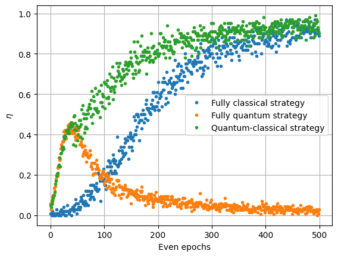

      
# Experimental Quantum Speed-up in Reinforcement Learning Agents (Qiskit Implementation)

This repository contains a Jupyter Notebook that implements and explores the concept of quantum-enhanced reinforcement learning (RL) as presented in the paper:

> V. Saggio, B. E. Asenbeck, A. Hamann, T. Strömberg, P. Schiansky, V. Dunjko, N. Friis, N. C. Harris, M. Hochberg, D. Englund, S. Wölk, H. J. Briegel, and P. Walther. *Experimental quantum speed-up in reinforcement learning agents*. Nature, 591(7849):229–233, 2021.
> [https://www.nature.com/articles/s41586-021-03242-7](https://www.nature.com/articles/s41586-021-03242-7)

The notebook demonstrates how a hybrid quantum-classical agent can achieve a learning speed-up compared to a purely classical agent by leveraging quantum amplitude amplification. The simulation uses Qiskit to implement the quantum circuits and compare the learning performance of different strategies.

## Authors

*   **Original Paper:** V. Saggio, B. E. Asenbeck, A. Hamann, T. Strömberg, P. Schiansky, V. Dunjko, N. Friis, N. C. Harris, M. Hochberg, D. Englund, S. Wölk, H. J. Briegel, and P. Walther
*   **Qiskit Implementation and Notebook:** Shashi Kumar

## Notebook Overview

The Jupyter Notebook (`Quantum_RL_Speedup.ipynb`) provides a step-by-step walkthrough of the experiment, including:

1. **Introduction:** Background on reinforcement learning and the concept of quantum speed-up.
2. **Theoretical Background:** Explanation of classical and quantum-enhanced RL, including amplitude amplification.
3. **Experimental Setup (Simulated):** Description of the components and their implementation in Qiskit.
4. **Simulation and Results:**
    *   Implementation of classical, quantum, and hybrid strategies.
    *   Code for running simulations and generating plots.
    *   Analysis of the results, demonstrating the learning speed-up.
5. **Discussion:** Interpretation of the findings and potential implications.
6. **Conclusion:** Summary of the key takeaways.
7. **Further Exploration:** Suggestions for extending the work.
8. **References:** Citations to relevant literature.

## Results

The following plot illustrates the average reward (η) over even epochs for the classical, quantum, and hybrid strategies. The hybrid strategy, which combines quantum amplitude amplification with classical updates, achieves a higher reward faster than the purely classical strategy, demonstrating a clear learning speed-up.

## Dependencies

To run the notebook, you will need the following Python libraries:

*   `qiskit`
*   `qiskit-aer`
*   `numpy`
*   `matplotlib`
*   `ipywidgets`
*   `pylatexenc`

## License

This project is licensed under the  MIT - see the LICENSE file for details.

## Acknowledgments

We acknowledge the authors of the original paper for their groundbreaking research.
This project utilizes the Qiskit quantum computing framework.
